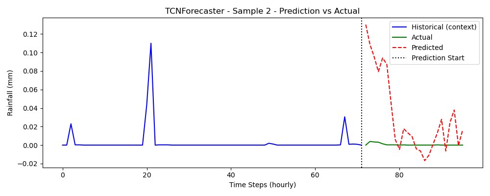

# Rainfall Prediction (Time Series Analysis)

## 1. Project Overview & Folder Structure

This repository implements a **modular deep-learning pipeline for multivariate time-series forecasting**.  
The use-case is **hourly environmental data** (e.g. temperature, humidity, wind speed) with the goal of predicting a future **rainfall**.

### Supported forecasters

| Model              | Type | Highlights |
|--------------------|------|------------|
| `lstm`             | Recurrent Seq-to-Seq | Learns long temporal dependencies via gated recurrence |
| `tcn`              | Temporal CNN        | Fast training, large receptive field through dilated 1-D convolutions |
| `deepar`           | Probabilistic RNN   | Forecasts a full predictive distribution (mean + quantiles) |

All models share a **common interface** exposed by `model_factory.py` for switching architectures by changing a CLI flag.

---

### Folder structure

```
📁 project-root/
├── 📁 artifacts/                      # Saved scalers, used during inference
├── 📁 conf/                          # Hydra configuration folder
│   ├── 📁 model_cfg/                 # Model-specific parameter files
│   │   ├── lstm.yaml                 # LSTM model hyperparameters
│   │   ├── tcn.yaml                  # TCN model hyperparameters
│   │   └── deepar.yaml              # DeepAR model hyperparameters
│   ├── config.yaml                  # Main Hydra config entrypoint
│   ├── logging.yaml                 # Logging configuration
│   ├── optuna_lstm.yaml             # Optuna sweep config for LSTM
│   ├── optuna_tcn.yaml              # Optuna sweep config for TCN
│   ├── optuna_deepar.yaml           # Optuna sweep config for DeepAR
│   └── optuna.yaml                  # (Optional) generic optuna config
├── 📁 data/                          # Raw or processed input datasets
├── 📁 images/plots/                 # Visualizations (e.g., loss curves)
├── 📁 logs/                          # Training or runtime logs
├── 📁 models/                        # Saved PyTorch models
├── 📁 src/                           # Main source code
│   ├── api_client.py                # Handles API requests for weather data from data.gov.sg
│   ├── data_loader.py               # Loads and prepares data for training/inference
│   ├── data_processor.py            # Cleans, aggregates, and transforms raw data
│   ├── evaluate.py                  # Evaluation metrics and visualization utilities
│   ├── general_utils.py             # General utility functions (e.g., for saving/loading)
│   ├── model.py                     # Defines LSTM/TCN/DeepAR models and forward logic
│   ├── model_factory.py             # Creates model instances based on config
│   ├── pipeline.py                  # Orchestrates the data flow: load → preprocess → train/evaluate
│   ├── predict.py                   # Performs inference using trained models
│   ├── time_series_dataset.py       # Custom PyTorch dataset class for time series
│   └── train.py                     # Training loop and optimizer/scheduler setup
├── 📁 tests/                         # Unit tests
│   └── test_pipeline_components.py  # Tests for core pipeline components
├── .gitlab-ci.yml                   # CI configuration for GitLab
├── Containerfile                    # Docker build file
├── eda.ipynb                        # Exploratory data analysis notebook
├── requirements.txt                 # Python dependencies
├── README.md                        # Project overview and instructions
└── run.sh                           # Entry point script for training/sweeps
```

---

## 2. Setup & Execution Instructions

### Installation

**Recommended: Using uv (10-100x faster dependency resolution)**

```bash
# Install uv if not already installed
curl -LsSf https://astral.sh/uv/install.sh | sh

# Clone and setup project
git clone <your-repo-url>
cd TSA-Project

# Install all dependencies (creates .venv automatically)
uv sync --all-extras
```

**Alternative: Traditional conda + pip**

```bash
conda create -n ts-forecast python=3.12.2 -y
conda activate ts-forecast
pip install -r requirements.txt
```

**Dependency Groups Available with uv:**
- `uv sync` - Core dependencies only
- `uv sync --extra ml` - Core + ML tools (optuna, mlflow, visualization)
- `uv sync --extra dev` - Core + development tools (testing, linting)
- `uv sync --all-extras` - Everything

### MLflow tracking (optional)

```bash
export MLFLOW_TRACKING_URI=<your_tracking_server_uri>
export MLFLOW_TRACKING_USERNAME=<your_username>
export MLFLOW_TRACKING_PASSWORD=<your_password>
```

---


#### Train an LSTM model for 50 epochs

```bash
bash run.sh 50 lstm
```

#### Train a TCN model for 100 epochs

```bash
bash run.sh 100 tcn
```

#### Run an Optuna sweep for the LSTM model

```bash
bash run.sh "" lstm sweep
```

#### Run an Optuna sweep for the TCN model

```bash
bash run.sh "" tcn sweep
```

#### Run prediction using a trained LSTM model

```bash
bash run.sh "" lstm predict
```

#### Run prediction for a specific date (e.g., July 1, 2025)

```bash
bash run.sh "" lstm predict predict.date=2025-07-01
```

---

### Notes

- The `run.sh` script routes execution to either `src.pipeline` (for training/sweeping) or `src.predict` (for inference).
- Optuna sweeps rely on separate search space definitions in YAML files like `optuna_lstm.yaml`, `optuna_tcn.yaml`, etc.
- Ensure model weights (e.g., `models/rainfall_lstm.pth`) and scalers (in `artifacts/`) are available for `predict` mode.


--- 
### Containerized Execution (Optional)

You can run the training pipeline inside a container using **Podman** or **Docker**.

---

#### 1. Build the Container

```
podman build -t rainfall-forecast .
# or using Docker
docker build -t rainfall-forecast .
```

---

#### 2. Set Up Environment Variables (Optional)

If you use **MLflow tracking**, create a `.env` file in your project root with the following content:

```
MLFLOW_TRACKING_URI=https://your-mlflow-server.com
MLFLOW_TRACKING_USERNAME=your-username
MLFLOW_TRACKING_PASSWORD=your-password
```
---

#### 3. Run the Training Pipeline

With default configuration (`conf/config.yaml`):

```
podman run --rm --env-file .env rainfall-forecast
# or
docker run --rm --env-file .env rainfall-forecast
```

With a custom number of epochs and model type (e.g., 10 epochs using LSTM):

```
podman run --rm --env-file .env rainfall-forecast 10 lstm
```

---

## 3. Pipeline Logic / Flow

### 1. Training Flow


### 2. Sweep Flow (Optuna Hyperparameter Search)


---

### 3. Prediction Flow


---

## 4. Preprocessing Steps Explanation

This section outlines the preprocessing pipeline used to prepare time-series data for forecasting models (e.g., LSTM, TCN, DeepAR). The pipeline ensures consistent scaling, temporal structuring, and reproducible train/validation splits.

---

### Temporal Split Strategy

Data is **chronologically split by timestamp** into **training** and **validation** sets using a configurable cutoff date (e.g., `"2023-01-01"`). This avoids data leakage by preserving the temporal structure of the time series.

| Parameter       | Purpose                                                 | Example Value       |
|------------------|----------------------------------------------------------|----------------------|
| `split_date`     | Timestamp defining where to split train/validation       | `"2024-01-01"`       |

> This ensures that **all validation data is strictly in the future** relative to the training data — a critical principle for time-series forecasting.

### Scaling Strategy

**Standardization** (Z-score normalization) is applied separately to input features and target variable:

| Scaler Type      | Fit On      | Applied To             | Purpose                      |
|------------------|-------------|-------------------------|------------------------------|
| `StandardScaler` | `train_df`  | `train_df`, `val_df`    | Normalizes input features    |

> The scalers are **fit only on the training data** to avoid data leakage, then applied to both sets.

---

### Sequence Construction

To enable sequence-to-sequence forecasting, the data is converted into overlapping windows:

| Parameter    | Description                                    | Example |
|--------------|------------------------------------------------|---------|
| `seq_len`    | Number of past time steps used as input        | `72`   |
| `pred_len`   | Number of future time steps to predict         | `24`    |
| `stride`     | Windowing step size (optional)                 | `1`     |

> Implemented via a custom `TimeSeriesDataset` that generates `(X, y)` pairs for model consumption.

---

### DataLoader Configuration

PyTorch `DataLoader`s are created with the following parameters:

| Loader       | Shuffle | Batch Size | Drop Last | Purpose                            |
|--------------|---------|------------|-----------|------------------------------------|
| `train_loader` | ✓     | e.g., `256` | ✗         | Batches and shuffles training data |
| `val_loader`   | ✗     | e.g., `256` | ✗         | Sequential batching for validation |

> Shuffling is applied only to training batches to preserve validation temporal integrity.

---

### Dataset Preparation Workflow

1. Load raw hourly weather dataset from `.csv`.
2. Split into `train_df` and `val_df` using `train_ratio`.
3. Apply log transformation to the target variable (to stabilize variance and reduce skew).
4. Fit `StandardScaler` to training features.
5. Apply same scaling to features in the validation set.
6. Construct `TimeSeriesDataset` from both splits.
7. Wrap datasets in PyTorch `DataLoader`s.

---

### Dataset Preparation Workflow

1. Load raw hourly weather dataset from `.csv`.
2. Split into `train_df` and `val_df` using `train_ratio`.
3. Apply log transformation to the target variable (to stabilize variance and reduce skew).
4. Fit `StandardScaler` to training features.
5. Apply same scaling to features in the validation set.
6. Construct `TimeSeriesDataset` from both splits.
7. Wrap datasets in PyTorch `DataLoader`s.

---

### Summary

This preprocessing ensures:

- **Temporal consistency**: no leakage across train/validation.
- **Feature normalization**: stable model training across different features.
- **Target transformation**: log scale ensures non-negative predictions, suitable for rainfall forecasting.
- **Flexible windowing**: supports multiple architectures (LSTM, TCN, DeepAR).
- **Reproducibility**: deterministic splits and transformations.

---


## 5. EDA Summary & Impact

### Missing Values


After hourly resampling, all features show some degree of missing timestamps, though the proportion is relatively small. The above shows a sample plot for missing values using the **rainfall** feature. Instead of discarding missing rows or using imputation-heavy techniques, we applied time-based interpolation followed by backfilling and forward filling to fill the values at the head and tail of the dataset that are missed by interpolation. This preserves temporal continuity without introducing artificial trends. Such treatment is particularly important for sequence models which rely on uninterrupted input streams to learn meaningful temporal patterns.

### Feature Scaling

The raw features in the dataset vary significantly in magnitude. For example,**wind_speed** is measured in meters per second, and **temperature** in degrees Celsius. To normalize their influence during training, we applied standardization (**StandardScaler**) to all features. Importantly, the scaler was fit only on the training split and then applied consistently across validation and test splits. This prevents information leakage and ensures fair evaluation. Scaling helps stabilize training and prevents models from being disproportionately influenced by high-variance features.

For the **rainfall** feature, log scaling was applied to address the skew, as well as the fact the predictions should not go below 0.

### Circular Encoding: Wind Direction

The `wind_direction` feature is expressed in degrees ranging from 0 to 360, which forms a natural circular scale. Feeding this raw angle into models can be misleading since 0° and 360° are close in direction but far apart numerically. To address this, we applied a circular encoding using sine and cosine transformations. This representation better captures the cyclic nature of wind direction and avoids artificial discontinuities in the input. It helps models more accurately interpret directional features like wind patterns.

### Target Distribution & Outliers


#### Rainfall Distribution:
- Highly **right-skewed**: majority of hourly values are **0 mm**, with occasional **sharp spikes**.
- The boxplot reveals a **long right tail**, with frequent "outliers" beyond **2.5 mm/hour**.
  - However, these "outliers" are typical features of rainfall patterns where most values are 0 and there are occasional spikes.

**Interpretation**:
- These spikes are typical of rainfall patterns and unlikely data errors.
- We retain all values and avoid clipping or removing "outliers".

### Decomposition


**Observations**

| Component   | Observations                                                                 |
|-------------|-------------------------------------------------------------------------------|
| **Trend**   | Long-term decline (2017–2019), recovery (~2020), flattening after 2022.      |
| **Seasonal**| Strong **annual** cycle with consistent peaks across years.                  |
| **Residual**| Frequent spikes relatively stationary.                |


The decomposition of the rainfall series reveals a strong seasonal component and a smooth long-term trend. Peaks in seasonality recur consistently year over year, indicating an underlying annual cycle. The trend component shows gradual changes across years. The residual component shows frequent spikes but is largely stationary.

These patterns suggest the use of recurrent and convolutional architectures that can leverage temporal patterns. The clear seasonal signal suggests that explicitly modeling seasonality or detrending the input data may improve performance. The residuals’ structure further supports the use of probabilistic models like **DeepAR**, which can model uncertainty in the residual space.

### Stationarity & Differencing


Autocorrelation (ACF) and partial autocorrelation (PACF) plots show a sharp drop after lag 1, implying that the series does not have long memory. First differencing is sufficient to induce stationarity in the series. This behavior suggests that the time series has short memory, making it well-suited for models that efficiently capture local temporal dependencies.

### Periodogram & Seasonality Confirmation


The periodogram analysis confirms a dominant frequency corresponding to approximately **8000** hours, which likely corresponds to **8760 hours** - one year. This validates the use of a seasonal period of 8760 in seasonal adjustment techniques, reinforcing the evidence from decomposition.

---

## 6. Model Architectures & Rationale

### Model Comparison for Time Series Forecasting

| Model               | Architecture Type  | Parameters (M) | Distinctive Features                                                        | Suitability for Time Series Task                                             |
|---------------------|--------------------|----------------|----------------------------------------------------------------------------|-------------------------------------------------------------------------------|
| LSTM                | Recurrent Neural Network | ~6.5            | Long Short-Term Memory cells, captures long-term dependencies               | Strong for sequential data, handles long-term dependencies well              |
| TCN                 | Temporal Convolutional Network | ~3.8            | Uses convolutions to capture temporal dependencies                          | Suitable for capturing temporal patterns and periodicities without RNNs      |
| DeepAR              | Recurrent Neural Network | ~6.0            | Uses GRU layers, probabilistic model for uncertainty estimation             | Best for probabilistic forecasting, good for multi-variate time series       |
| Transformer         | Attention-based Model | ~10-20          | Self-attention mechanism for capturing long-range dependencies              | Great for handling complex, long-range temporal dependencies in time series |
| Prophet             | Additive Model with Seasonal and Trend Components | -              | Implements time-series decomposition (trend, seasonality, holidays)         | Simple and interpretable model, effective for seasonal data                  |
| N-Beats             | Neural Network-based Model | ~7.5            | Deep learning architecture for time-series forecasting, interpretable      | Designed for long-term forecasting, easy to adapt to various time series    |

The decision to experiment with **LSTM**, **TCN**, and **DeepAR** for time-series forecasting is based on the unique strengths each model offers in capturing temporal patterns, seasonality, and uncertainty.

#### 1. **LSTM (Long Short-Term Memory)**
LSTM is a type of Recurrent Neural Network (RNN) designed to overcome the vanishing gradient problem. It is highly effective in capturing long-term dependencies and sequential patterns.

**Rationale:**
- **Captures Temporal Dependencies**: LSTMs are ideal for modeling long-range dependencies, such as seasonal patterns and trends.
- **Proven Success**: LSTMs have been widely used in time-series forecasting across domains like finance and weather.

[LSTM Reference](https://arxiv.org/abs/1402.1128)

#### 2. **TCN (Temporal Convolutional Network)**
TCNs replace RNNs with convolutional layers to model temporal dependencies. They often outperform LSTMs due to better parallelization and the use of dilated convolutions.

**Rationale:**
- **Efficiency**: TCNs can process sequences in parallel, making them faster to train than LSTMs.
- **Long-Range Dependencies**: Dilated convolutions allow TCNs to capture long-term dependencies without the vanishing gradient issue.

[TCN Reference](https://arxiv.org/abs/1803.01271)

#### 3. **DeepAR (Deep Autoregressive Model)**
DeepAR is a probabilistic forecasting model that outputs a distribution over future values, providing uncertainty estimates alongside predictions.

**Rationale:**
- **Probabilistic Forecasting**: DeepAR provides a full distribution over future values, crucial for scenarios requiring uncertainty quantification.
- **Scalable**: DeepAR is effective for large-scale time-series datasets and models dependencies in an autoregressive manner.

By experimenting with these three models, we can gain insights into their performance and select the one that offers the best balance of accuracy, uncertainty modeling, and computational efficiency for the time-series forecasting task at hand.

[DeepAR Reference](https://arxiv.org/abs/1704.04110)

---

## 7. Evaluation Metrics & Results Comparison

Here we evaluate each of the models on the training validation datasets.

### 7.1 Long Short-Term Memory (LSTM) Model


| Model     | **Train RMSE** | **Train R-squared** | **Train Loss** | **Val RMSE** | **Val R-squared** | **Val Loss** | Notes                          |
|-----------|----------------|---------------------|----------------|--------------|-------------------|--------------|--------------------------------|
| **LSTM**  |0.106      | 0.106            |0.00573        | 0.111      | 0.042          | 0.0063     | 24-hour horizon                |


#### Observations

- **Training loss** decreases consistently, indicating that the model is fitting to the training data.
- **Validation loss** decreases early but flattens out around epoch 20–25 and exhibits minor fluctuations afterward.
- **RMSE and R²**:
  - **Validation RMSE** improves at first but shows diminishing returns later.
  - **R² score** remains below 0.2, which suggests the model still struggles to explain variance in the target.
- The gap between training and validation metrics is small, suggesting the model is not overfitting, but also not capturing deeper patterns yet.

#### Interpretations

- The model appears to be underfitting — it is not overfitting the training data, but is also not performing strongly on validation.
- This could be due to:
  - Insufficient model capacity (e.g., hidden size or depth)
  - Not enough informative features or high noise in target (rainfall is inherently spiky and sparse)

#### Sample Predictions


### 7.2 Temporal Convolutional Network (TCN)


| Model     | **Train RMSE** | **Train R-squared** | **Train Loss** | **Val RMSE** | **Val R-squared** | **Val Loss** | Notes                          |
|-----------|----------------|---------------------|----------------|--------------|-------------------|--------------|--------------------------------|
| **TCN**  |0.109      | 0.0503           |0.00612        | 0.111      | 0.044          | 0.0063     | 24-hour horizon                |


#### Observations

- **Train Loss and RMSE**
  - Rapid decrease in the first few epochs, followed by a smooth and gradual decline.
  - Loss flattens around epoch 40–50, suggesting convergence.

- **Validation Loss and RMSE**
  - Mirrors the train loss trend closely, with no upward spikes — indicating no overfitting.
  - Validation RMSE steadily drops, reaching a low and stable point near the end.

- **Train R²**
  - Starts from negative (~-0.4), quickly rises above zero.
  - Plateaus slightly below **0.05**, indicating moderate correlation between predicted and true values.

- **Validation R²**
  - Starts slightly negative and improves gradually.
  - Ends around **0.04**, indicating the model explains ~4% of the variance on the validation set.

#### Interpretations

- **Training Stability**
  - Overall model metrics seem poor, but model is training is stable.

- **Generalization**
  - The validation loss tracks closely with the training loss.
  - No sign of overfitting — validation performance improves throughout.

- **Predictive Power**
  - While the loss and RMSE improve, the R² scores remain relatively low.
  - Like with the other models, this is expected due to the noisy, sparse nature of rainfall data.
  - A validation R² of 0.044 suggests the model lacks strong predictive power.

#### Sample Predictions




### 7.3 DeepAR Model


| Model     | **Train RMSE** | **Train R-squared** | **Train Loss** | **Val RMSE** | **Val R-squared** | **Val Loss** | Notes                          |
|-----------|----------------|---------------------|----------------|--------------|-------------------|--------------|--------------------------------|
| **DeepAR**  |0.1078     | 0.0754       |0.00591        | 0.110      | 0.061         | 0.0062    | 24-hour horizon                |


#### Observations

- **Train Loss and RMSE**
  - Both train loss and RMSE decrease consistently over 40 steps.
  - Suggests that the model is learning effectively from the training data.

- **Validation Loss and RMSE**
  - Validation metrics also decrease and stabilize, indicating generalization is preserved.
  - Does not seem to be overfitting though overall metrics are poor.

- **Train R²**
  - Increases gradually, reaching ~0.06 by the end of training.

- **Validation R²**
  - Consistently improves throughout training.
  - Final value is around **0.06**, suggests the model lacks strong predictive power.

---

#### Interpretations

- **Training Stability**
  - Overall model metrics seem poor, but model is training is stable.

- **Low R² Values**  
  - An R² of ~0.06 indicates that the model explains only ~6% of the variance in the validation target.
    - Suggests the model lacks strong predictive power though this may not be surprising for rainfall forecasting which is inherently noisy and highly skewed.

- **RMSE Behavior**  
  - RMSE tracks closely with loss, validating the loss function used during training.
  - Gradual decline confirms incremental gains but plateaus at around 0.11 - a fairly high error in the context of the historical rainfall.

#### Sample Predictions


### Summary


| Model     | **Train RMSE** | **Train R-squared** | **Train Loss** | **Val RMSE** | **Val R-squared** | **Val Loss** | Notes                          |
|-----------|----------------|---------------------|----------------|--------------|-------------------|--------------|--------------------------------|
| **LSTM**  |0.106      | 0.106            |0.00573        | 0.111      | 0.042          | 0.0063     | 24-hour horizon                |
| **TCN**  |0.109      | 0.0503           |0.00612        | 0.111      | 0.044          | 0.0063     | 24-hour horizon                |
| **DeepAR**  |0.1078     | 0.0754       |0.00591        | 0.110      | 0.061         | 0.0062    | Point forecast = mean                |

Overall model performances were relatively poor with RMSE of about 0.11 - a fairly high error in the context of the historical rainfall. The DeepAR model showed the most promise overall with validation R² or 0.061, but also showed to be the most likely to overfit the data.

---

## 8. Conclusion & Future Improvements

### **Experimentation Results**

- Among the three, **DeepAR** achieves the best R² (~0.061), indicating only modest predictive power.
- All 3 models achieved around the same RMSE of about 0.11.

### **Challenges Observed**

- All three models (LSTM, TCN, DeepAR) performance leave a lot of room for improvement on the rainfall predictions.
- Main challenge is with the inherent nature of **rainfall** where there is extreme class imbalance with rainfall being **0 mm** the majority of time, and very noisy when rainfall does occur
  
- Training time and computational constraints
  - Limited experimentation cycles prevented exhaustive hyperparameter tuning.
  - Model performance is likely to improve at least slightly with further hyperparameter tuning.

### **Possible Next Steps**

1. **Hyperparameter Optimization**
   - Perform wide Optunasearch to further tune hidden size, learning rate, dropout rate, and sequence length.

2. **Model Ensembling**
   - Blend predictions from LSTM, TCN, and DeepAR using stacking or averaging to increase robustness.
